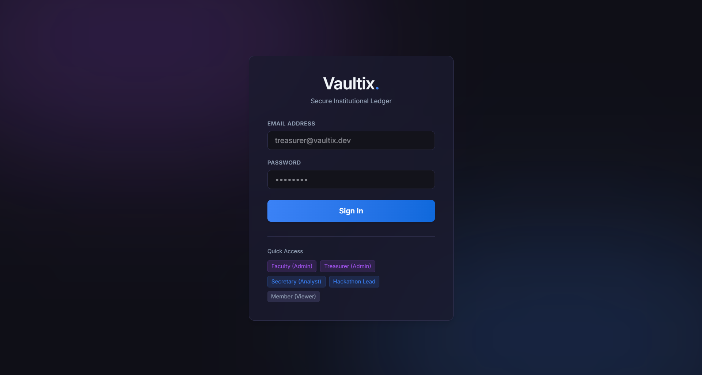
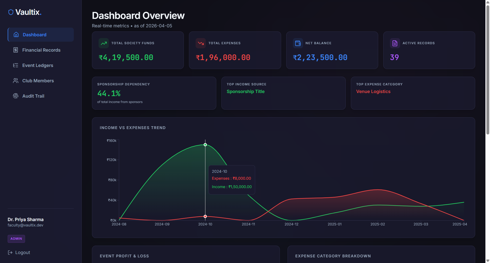
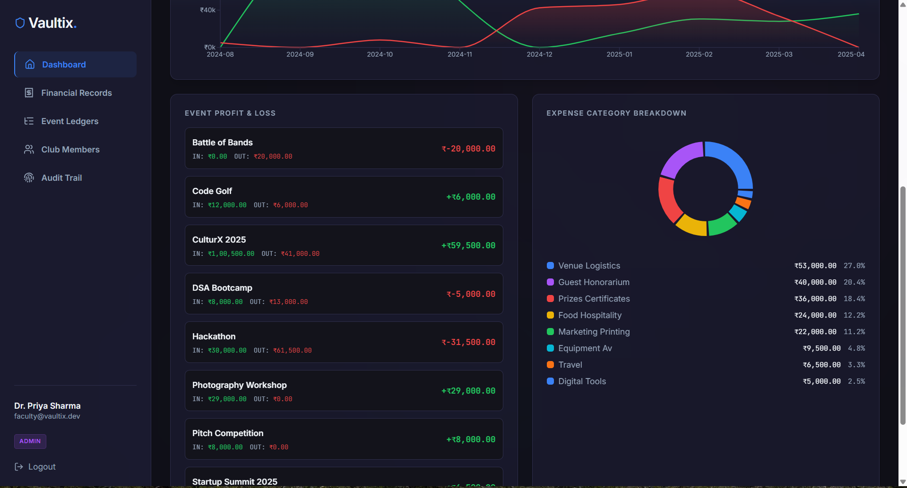
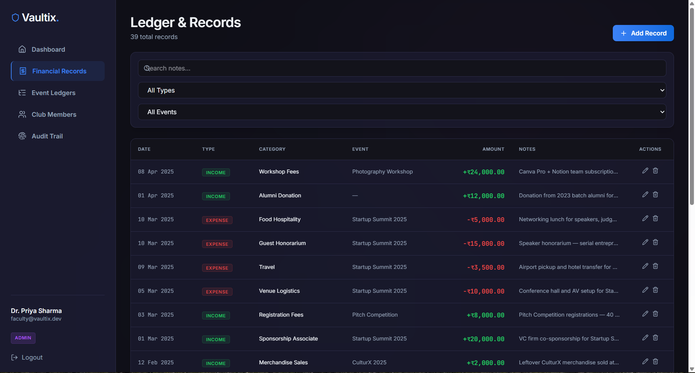
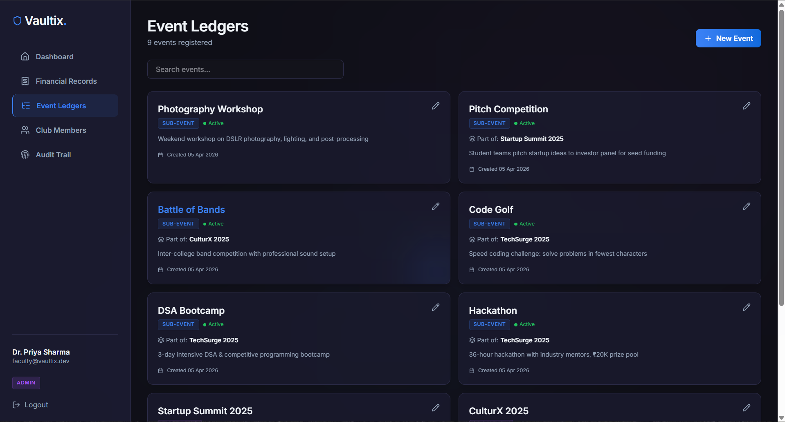
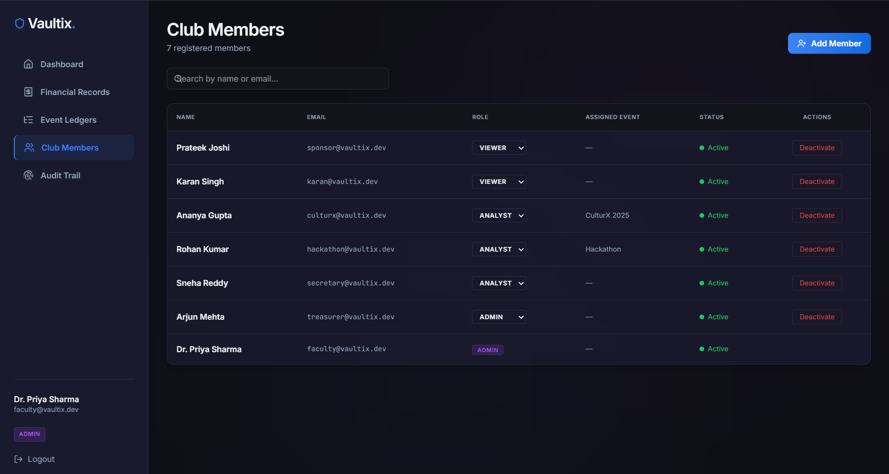
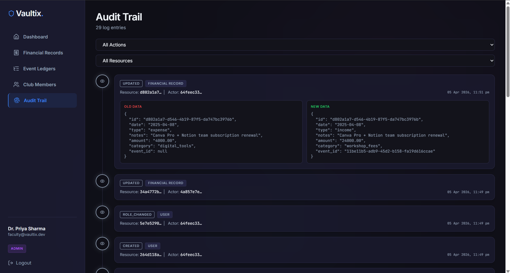

# Vaultix

**Finance Management Platform for Organizations**

Vaultix is a full-stack, role-aware, auditable finance management system built for institutional and organization committees. It tracks income and expenses across events, enforces strict access control through role-based access control (RBAC), and provides macro and micro-level analytics. 

Built with **React (TypeScript), FastAPI, PostgreSQL, and Docker**.

---

## UI Previews

### Secure Login & Role Assignment

*Role-aware secure login portal with Quick Access seeded users for testing.*

### Dashboard Analytics (Macro metrics)

*High-level financial summaries showing net balance, total income, and total expenses natively aggregated by the backend.*

### Dashboard Analytics (Micro metrics)

*Interactive category breakdowns and 6-month historical spending trend analytics.*

### Financial Ledgers

*Full CRUD interface for managing transactions, completely paginated and sortable with soft-delete capabilities.*

### Event Hierarchy

*Hierarchical event mapping isolating financial boundaries (e.g., Major Fest vs Sub-Events).*

### User Governance

*Role-based access control interface strictly available to Admins for member onboarding and permission elevation.*

### System Accountability

*Immutable system ledger tracking who performed what action, when, and exactly what data was changed.*

---

## Features & Architecture

### 1. User & Role Management
Vaultix supports a comprehensive role-hierarchy out of the box, mapping real-world governance accurately via custom interceptors and RoleGuard middleware:
- **Admin**: Full control. Can manage users, create/edit/delete events, and manage all financial records.
- **Analyst**: Can view records and access all analytical endpoints, but cannot invoke destructive or modifying actions.
- **Viewer**: Read-only access restricted strictly to high-level dashboard summaries.

### 2. Financial Records Management
Full CRUD support for financial data entries (transactions). Each record tracks:
- Amount and transaction type (Income/Expense).
- Categorization (e.g., Sponsorship, Venue Logistics, Registration Fees).
- Event mappings (linking records to specific major fests or sub-events).
- Extensive filtering support over an API (by type, category, date_from, date_to, event, and pagination).

### 3. Dashboard Summary APIs
Complex aggregation APIs drive the frontend dashboards without needing raw calculations client-side:
- Top-level metrics (Total Income, Total Expenses, Net Balance)
- Category-wise spending breakdowns
- Monthly/weekly chronological financial trends
- Event-specific Profit & Loss (P&L) ledgers

### 4. Robust Validation & Error Handling
- **Pydantic Schemas**: Strict input validation ensuring data integrity at the edge.
- **Standardized Error Responses**: All API errors return a predictable `{"error": {"code": "...", "message": "..."}}` envelope with accurate HTTP status codes (400, 401, 403, 404, 409, 422, etc.).
- **Global Exception Handlers**: Graceful fallback for unexpected failures.

### 5. Access Control Logic (Security)
Backend-level access control via robust dependency injection mechanisms in FastAPI. JWT-based token authentication restricts endpoints, verifying ownership, token validity, and minimum role permissions on a per-route basis.

### 6. Persistence & Auditability 
- **PostgreSQL**: Used for all relation-heavy data persistence via asynchronous SQLAlchemy.
- **Soft Deletes**: Financial records are never hard deleted to preserve accountability. They are marked inactive via `is_deleted` and hidden from analytics, preserving data integrity.
- **Audit Trails**: Built-in system logging tracking every Create, Update, Delete, and Role Change action to prevent ghost transactions.

---

## Tech Stack

**Frontend:**
- React (Vite)
- TypeScript
- Tailwind CSS v4 & Lucide Icons
- React Router DOM
- Axios

**Backend:**
- Language: Python 3.11+
- Framework: FastAPI
- Database: PostgreSQL & Asyncpg
- ORM: SQLAlchemy 2.0 (async)
- Migrations: Alembic
- Auth: JWT (python-jose) + Bcrypt
- Validation: Pydantic v2

---

## Getting Started (Docker Compose)

The easiest way to run Vaultix is via Docker Compose, which spins up the Database, Backend (FastAPI), and Frontend (Nginx/React).

```bash
# Clone the repository
git clone <repository_url>
cd vaultix

# Start the full stack
docker compose up --build -d
```

### Access Points
- **Frontend Dashboard:** [http://localhost:5173](http://localhost:5173)
- **Backend API Docs (Swagger UI):** [http://localhost:8000/docs](http://localhost:8000/docs)
- **Postgres Database:** `localhost:5433` (User: `vaultix` | Pass: `vaultix_secret` | DB: `vaultix_db`)

### Seed Data Credentials 
The database will automatically populate with realistic test data upon starting (7 users, 9 events, 40+ ledgers, 20+ audit logs). Log in to `http://localhost:5173` using the Quick Access buttons on the login page or these credentials:

- **Admin**: `faculty@vaultix.dev` / `faculty123`
- **Admin (Treasurer)**: `treasurer@vaultix.dev` / `treasurer123`
- **Analyst (Secretary)**: `secretary@vaultix.dev` / `secretary123`
- **Viewer**: `karan@vaultix.dev` / `karan123`

---

## API Overview
Prefix: `/api/v1`

| Resource | Endpoints | Access |
|---|---|---|
| **Users** | `POST /users`, `PATCH /users/{id}/role` | Admin |
| **Auth** | `POST /auth/login`, `GET /auth/me` | Public / All |
| **Events** | `GET /events`, `POST /events`, `PATCH /events/{id}` | Admin/Analyst |
| **Records**| `GET /records`, `POST /records`, `DELETE /records/{id}` | Admin/Analyst |
| **Dashboard**| `/dashboard/summary`, `/dashboard/trends`, `/dashboard/events`| Adm/Ana/View |
| **Audit** | `GET /audit-logs` | Admin/Analyst |

---